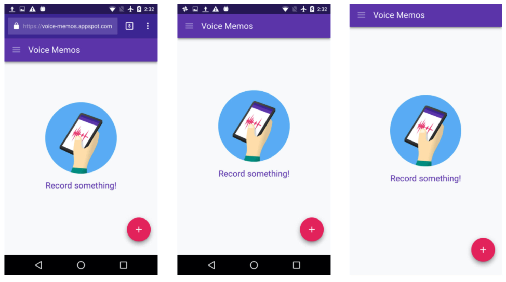

# Web App ManiFest

- Install Banner & App Icon
- Progressive Web App의 설치와 앱 구성정보를 닫고 있는 json 형식의 설정파일
  > 앱 아이콘, 화면 런쳐 방식 및 배경색, 시작페이지 등을 설정할 수 있는 json 파일

### 앱 관련 구성정보

- Start URL : 웹 앱이 시작되는 지점
- Launch Image : 웹 앱 시작화면
- Display Type : 웹 앱의 화면 형태
- Display Orientation : 웹 앱 화면 방향
- App Icon : 앱 아이콘 이미지와 크기

```json
{
  "short_name": "앱 아이콘 이름",
  "name": "하단 설치 배너에 표기될 이름 & 앱에서 검색시 키워드",
  "icons": [
    "src": "dist/images/icons/icon-32*32.png",
    "type": "image/png",
    "sizes": "32*32"
  ],
  "background_color": "#1E88E5",
  "display": "standalone",
  "start_url": "./"
}
```

1.

### 2. Launch Image - Splash Screen

- 웹앱이 시작될 때 거치는 시작 화면을 설정 가능
- **모바일 앱의 시작과 동일한 느낌을 가져감**
- 화면의 조합: 아이콘 + 배경색 + 아이콘 이름
- 배경색 설정은 background_color 속성 이용
  > "background_color": "#2196F3"

### 3. Start URL

- 앱이 시작될 때 로딩될 페이지 위치 지정
  > "start_url": "./"
- GA 분석이나 기타 목적으로 query string 을 뒤에 붙일 수 있다.
  > "start_url": "index.html?launcher=homescreen"

### 4. Display Type

- 웹앱 화면의 전체적인 모양을 정할 수 있다.
- 웹앱이 모바일 앱의 느낌을 가졀 수 있도록 결정짓는 속성
- **"display": "standalone"**
  - standalone: 상단 URL바 제거하여 네이티브 앱 느낌을 제공
  - browser : 해당 OS 브라우저에서 웹앱 실행
  - fullscreen : 크롬이 아닌 기타 브라우저에서 네이티브 앱 느낌 제공
  - minumul-ui : fullscreen과 비슷하나 네비케이션 관련 최소 UI를 제공
- **주의사항**: iOS에서 standalone 사용시
- `<a>` 를 이용한 네비게이션 이동 시 새 브라우저 열기로 인해 context를 잃게 됨
- 따라서, location.href 또는 SPA를 이용한 네비케이팅으로 전체 UX를 가져갈 필요가 있음
  > <meta name="apple-mobile-web-app-capable" content="yes">
- 

### 5. Theme Color

### 6. Display Orientation

- 화면방향 설정
  > portrait : 세로방향  
  > landscape : 가로방향

```json
"orientation": "portrait"
```

### Web App Install Banner

- PWA가 모바일적인 특징을 가지는 큰 부분의 하나
- 동작조건
  - `start_url`, `short_name`, `name` 설정
  - 아이콘은 192px 및 512px 크기의 아이콘을 포함해야합니다.
  - Service Worker의 fetch 이벤트 구현
  - https

# Service Worker

- 브라우저와 서버 사이의 미들웨어 역활을 하는 스크립트 파일
- 평소에 알고있는 자바 스크립트와 Service worker의 자바스크립트는 다르다

### 특징

### Service Worker 등록

### Service Worker 설치

### Servie Worker Network 요청 응답

- 서비스워커 설치 후 캐쉬된 자원에 대한 네트워크 요청이 있을대 캐쉬로 돌려준다.

### Service Worker 활성화 및 업데이트

- 새로운 서비스워커가 설치되면 활성화 단계로 넘어온다.
- 이전에 사용하던 서비스워커와 이전 캐쉬는 모두 삭제하는 작업 진행
  > 기존에 실행 중인 서비스워커와 사이즈를 비교하여 1바이트라도 차이나면 새걸로 간주

### Service Worker 라이플 싸이클

- 서비스쿼커는 웹 페이지와 별개의 생명주기
